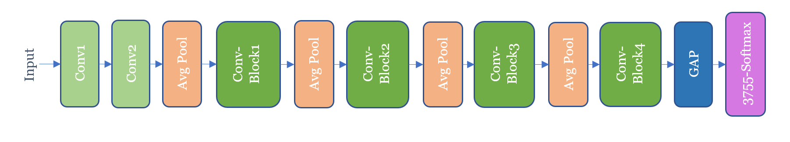

# Offline Handwritten Chinese Character Classifier
## Description:

- recognizes isolated handwritten Chinese characters among 3755 classes of GB2312-80 level-1 standard;

- based on a CNN called 'MELNYK-Net';

- implemented in Keras with TensorFlow backend: 

- Trained on CASIA-HWDB1.0-1.1 datasets collected by National Laboratory of Pattern Recognition (NLPR), Institute of Automation of Chinese Academy of Sciences (CASIA), written by 420 and 300 persons. The overall training dataset contains 2,678,424 samples.

- Evaluated on the most common benchmark – ICDAR-2013 competition dataset containing 224,419 samples written by 60 persons.

- **Final accuracy** - 97,00%.

- **Total number of parameters** - 9,145,643 (~35 MB of storage).

## Usage:
 - before using the application, please download [MELNYK-Net](https://drive.google.com/open?id=12UVBrGixJLmg6er1bsLC52rWIlSv00Fs) and place it in the directory with the other files (don't change the name);
 - run 'main.py';
 - follow the prompt instructions:
    - specify the isolated character image/images directory (e.g. 'images/'; it will upload all the images from this folder);
    - specify *n* number of candidates for recognition - will show *n* most confident predictions per each character image;
    - type 'y' if you want to continue using application.
    

## Demo:

